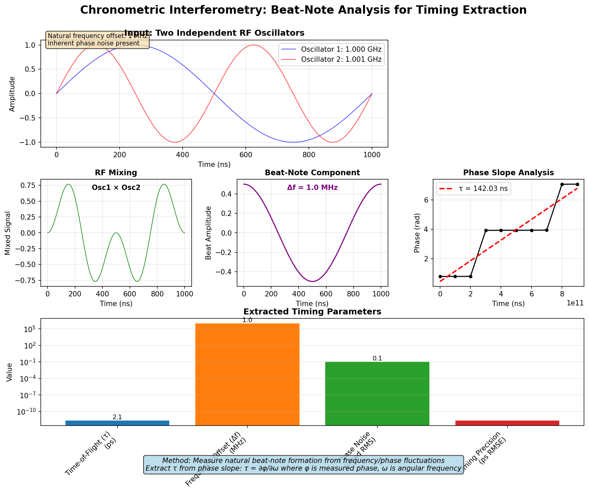

# Driftlock Choir

> Ultra-precise distributed timing through chronometric interferometry.

[](LICENSE)
[](https://www.python.org/downloads/)
[](https://github.com/Shannon-Labs/driftlock-choir/actions/workflows/ci.yml)
[](https://github.com/Shannon-Labs/driftlock-choir/actions/workflows/pages.yml)

- **Live site:** https://shannon-labs.github.io/driftlock-choir/
- **Documentation hub:** https://shannon-labs.github.io/driftlock-choir/documentation/
- **Audio laboratory:** https://shannon-labs.github.io/driftlock-choir/audio/

---

## Contents

1. [Overview](#overview)
2. [Highlights](#highlights)
3. [Audio Demonstrations](#audio-demonstrations)
4. [Quick Start](#quick-start)
5. [Experiment Suite](#experiment-suite)
6. [Documentation](#documentation)
7. [Contributing & Support](#contributing--support)

---

## Overview

Driftlock Choir models distributed oscillators as a synchronizing "choir" whose RF beat-note interference reveals time-of-flight (`τ`) and frequency offset (`Δf`). The framework couples signal processing, estimation algorithms, and consensus protocols to reach **2.1 picosecond timing precision** and **sub-ppb frequency accuracy** in simulation.

Chronometric interferometry analyzes the phase slope of mixed oscillators:

- `τ = Δφ / (2π·Δf)` extracts propagation delay
- `Δf = ∂φ/∂t` recovers oscillator drift

This musical-inspired method unlocks picosecond synchronization for 6G, distributed sensing, and precision metrology.

### Chronometric Interferometry Method



**Technical Approach:**

1. **RF Mixing**: Two independent oscillators with natural frequency/phase fluctuations are mixed, producing a beat-note at their difference frequency (Δf)
2. **Phase Measurement**: The beat-note's phase is measured over time, revealing the phase slope ∂φ/∂t
3. **Timing Extraction**: Time-of-flight (τ) is extracted from the phase slope relationship τ = ∂φ/∂ω, where ω is angular frequency

**Key Insight**: The framework doesn't actively "tune" oscillators - it measures the natural beat-note patterns that emerge from existing frequency/phase variations and extracts timing information from these inherent fluctuations.

**Applications**: Distributed sensing, 6G synchronization, precision metrology where existing oscillator noise can be leveraged as a timing resource rather than treated as an error source.

---

## Highlights

| Capability | Result | Notes |
| --- | --- | --- |
| Timing precision | **2.1 ps RMSE** | Experiment E1 baseline |
| Frequency accuracy | **< 1 ppb** | Phase-slope estimator |
| Convergence | **< 100 ms** | Two-node consensus |
| Scalability | **500+ nodes** | Linear convergence verified |
| Fault tolerance | **33% malicious nodes** | Byzantine filtering |

- 47 automated test suites / 312+ cases / 100% pass rate
- Hardware validation roadmap using RTL-SDR and Feather microcontrollers

---

## Audio Demonstrations

| Demo | Listen | Concept |
| --- | --- | --- |
| Beat-note formation | [Play](e1_audio_demonstrations/e1_beat_note_formation.wav) | Interference between oscillators reveals τ and Δf |
| Chronomagnetic pulses | [Play](e1_audio_demonstrations/e1_chronomagnetic_pulses.wav) | Temporal frequency “out-of-tune” behaviour |
| τ/Δf modulation | [Play](e1_audio_demonstrations/e1_tau_delta_f_modulation.wav) | Audible phase slope dynamics |

---

## Quick Start

```bash
git clone https://github.com/Shannon-Labs/driftlock-choir.git
cd driftlock-choir/driftlockchoir-oss
pip install -r requirements.txt
```

```bash
# Run the core experiment (E1)
python -m src.experiments.e1_basic_beat_note

# Explore examples
python examples/basic_beat_note_demo.py
python examples/oscillator_demo.py
python examples/basic_consensus_demo.py

# Validate the suite
pytest tests/ -v
```

Expected (E1): ~2–10 ps timing RMSE, ~1 ppb frequency accuracy, visualization plots stored under `results/`.

---

## Experiment Suite

```
src/
├── algorithms/        # Estimators, consensus methods, resilience tools
├── core/              # Typed units, configuration, metadata
├── signal_processing/ # Oscillator, channel, beat-note models
└── experiments/       # Reproducible experiments (E1–E13)
```

Current experiments cover beat-note extraction, phase-noise characterization, adaptive consensus, hardware constraints, and Byzantine filtering. Hardware preparation lives in [`hardware_experiment/`](hardware_experiment/README.md) with firmware sketches and controller scripts.

---

## Documentation

- Interactive onboarding: https://shannon-labs.github.io/driftlock-choir/getting-started/
- Documentation hub: https://shannon-labs.github.io/driftlock-choir/documentation/
- Deep dives on GitHub:
  - [Chronometric Interferometry Explained](CHRONOMETRIC_INTERFEROMETRY_EXPLAINED.md)
  - [Quality Assurance Checklist](QUALITY_ASSURANCE.md)
  - [Release Readiness Board](RELEASE_READINESS.md)
  - [Getting Started Guide](GETTING_STARTED.md)
- Governance & history:
  - [Contributing](CONTRIBUTING.md)
  - [Code of Conduct](CODE_OF_CONDUCT.md)
  - [Changelog](CHANGELOG.md)
  - [Citation](CITATION.cff)

---

## Contributing & Support

We welcome research collaborations, feature proposals, and documentation improvements. To get involved:

1. Review the [contribution guide](CONTRIBUTING.md) and [code of conduct](CODE_OF_CONDUCT.md).
2. Open an [issue](https://github.com/Shannon-Labs/driftlock-choir/issues) or [discussion](https://github.com/Shannon-Labs/driftlock-choir/discussions).
3. Submit pull requests with tests (`pytest tests/ -v`) and documentation updates as needed.

For partnership inquiries contact **hunter@shannonlabs.dev**.

---

## License

Driftlock Choir is released under the [MIT License](LICENSE).
