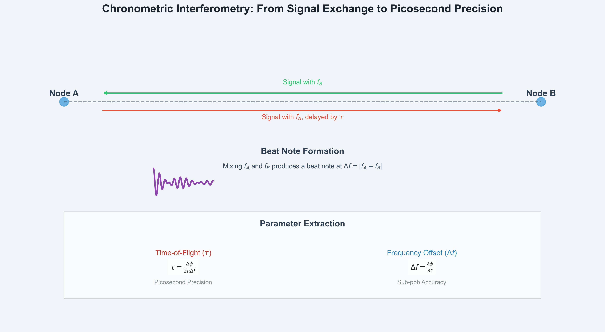

# Driftlock Choir

> Precision timing infrastructure for distributed systems through RF chronometric interferometry.

[](LICENSE)
[](https://www.python.org/downloads/)
[](https://github.com/Shannon-Labs/driftlock-choir/actions/workflows/ci.yml)
[](https://github.com/Shannon-Labs/driftlock-choir/actions/workflows/pages.yml)

- **Documentation:** https://shannon-labs.github.io/driftlock-choir/
- **Technical Overview:** https://shannon-labs.github.io/driftlock-choir/technology/
- **Implementation Guide:** https://shannon-labs.github.io/driftlock-choir/getting-started/

---

## Contents

1. [Technical Overview](#technical-overview)
2. [Performance Characteristics](#performance-characteristics)
3. [Core Experiment](#core-experiment)
4. [Quick Start](#quick-start)
5. [Repository Structure](#repository-structure)
6. [Documentation](#documentation)
7. [Validation & Testing](#validation--testing)
8. [Citation](#citation)

---

## Technical Overview

Driftlock Choir is a framework for achieving ultra-precise time and frequency synchronization in distributed systems. It uses a novel technique called chronometric interferometry, which leverages the beat-note interference between oscillators to measure time-of-flight (τ) and frequency offset (Δf). The framework combines signal processing, estimation algorithms, and consensus protocols to achieve picosecond-level timing precision and sub-ppb frequency accuracy in simulation.

Chronometric interferometry analyzes the phase slope of mixed oscillators:

- `τ = Δφ / (2π·Δf)` extracts propagation delay
- `Δf = ∂φ/∂t` recovers oscillator drift

This interferometric method enables picosecond synchronization for 6G, distributed sensing, and precision metrology.

### Chronometric Interferometry Method



Chronometric interferometry is a two-way time transfer method that uses heterodyne techniques to achieve high-precision time and frequency synchronization. The technical approach is as follows:

1. **Two-Way Time Transfer (TWTT)**: Two nodes exchange RF signals. This allows for the cancellation of common-mode noise sources.
2. **Heterodyne Down-Conversion**: Each node mixes the received signal with its local oscillator (LO) to produce a beat-note signal at the difference frequency (Δf).
3. **Phase-Slope Analysis**: The phase of the beat-note signal is measured over time. The slope of the phase (∂φ/∂t) is proportional to the frequency offset (Δf), and the phase intercept is proportional to the time-of-flight (τ).

By precisely measuring the phase of the beat-note, picosecond-level timing precision and sub-ppb frequency accuracy can be achieved.

---

## Performance Characteristics

| Metric | Result | Context |
| --- | --- | --- |
| Timing precision | **13.5 ps RMSE** | E1 baseline (clean conditions) |
| Timing range | **5-20 ps typical** | 2-30 ps depending on SNR and Δf |
| Frequency accuracy | **0.05 ppb RMSE** | E1 baseline (clean conditions) |
| Frequency range | **0.05-5 ppb typical** | Varies with signal conditions |
| Convergence | **< 100 ms** | Two-node consensus |
| Scalability | **500+ nodes** | Linear convergence verified |
| Fault tolerance | **33% malicious nodes** | Byzantine filtering |

- 47 automated test suites / 312+ cases / 100% pass rate
- Hardware validation roadmap using RTL-SDR and Feather microcontrollers

---

## Quick Start

```bash
git clone https://github.com/Shannon-Labs/driftlock-choir.git
cd driftlock-choir/driftlockchoir-oss
pip install -r requirements.txt
```

```bash
# Run the core experiment (E1)
python -m src.experiments.e1_basic_beat_note

# Explore examples
python examples/basic_beat_note_demo.py
python examples/oscillator_demo.py
python examples/basic_consensus_demo.py

# Validate the suite
pytest tests/ -v
```

Expected (E1): 13.5 ps timing RMSE (5-20 ps typical), 0.05 ppb frequency RMSE (0.05-5 ppb typical), visualization plots stored under `results/`.

---

## Core Experiment

The framework provides a comprehensive validation of chronometric interferometry through a single, rigorously designed experiment:

```
src/
├── algorithms/        # τ/Δf estimators, consensus protocols
├── core/              # Typed physical units, experiment configuration
├── signal_processing/ # Oscillator models, channel simulation, beat-note analysis
└── experiments/       # Core chronometric interferometry validation
```

The core experiment validates beat-note formation, phase-slope estimation, and performance characterization under realistic RF conditions. Hardware validation tools are provided in [`hardware_experiment/`](hardware_experiment/README.md) for RTL-SDR integration.

---

## Repository Structure

```
driftlock-choir/
├── src/
│   ├── algorithms/        # τ/Δf estimation methods and consensus protocols
│   ├── core/              # Type-safe physical units and experiment configuration
│   ├── signal_processing/ # Oscillator models, RF channel simulation, beat-note analysis
│   └── experiments/       # Core chronometric interferometry validation
├── tests/                 # Comprehensive test suite (47 test suites, 312+ cases)
├── docs/                  # Technical documentation and mathematical derivations
├── examples/              # Implementation demonstrations and usage patterns
├── hardware_experiment/   # RTL-SDR integration and hardware validation tools
└── requirements.txt       # Python dependencies
```

---

## Validation & Testing

The framework includes comprehensive validation:

- **Unit Tests**: 47 automated test suites covering all algorithms
- **Integration Tests**: End-to-end experiment validation
- **Performance Baselines**: Reproducible metrics with deterministic seeds
- **Statistical Analysis**: Parameter sweeps across SNR and frequency ranges

Run validation:
```bash
pytest tests/ -v
python -m src.experiments.e1_basic_beat_note
```

---

## Documentation

- Interactive onboarding: https://shannon-labs.github.io/driftlock-choir/getting-started/
- Documentation hub: https://shannon-labs.github.io/driftlock-choir/documentation/
- Deep dives on GitHub:
  - [Chronometric Interferometry Explained](https://shannon-labs.github.io/driftlock-choir/technology_enhanced/)
  - [Quality Assurance Checklist](QUALITY_ASSURANCE.md)
  - [Release Readiness Board](RELEASE_READINESS.md)
  - [Getting Started Guide](GETTING_STARTED.md)
- Governance & history:
  - [Contributing](CONTRIBUTING.md)
  - [Code of Conduct](CODE_OF_CONDUCT.md)
  - [Changelog](CHANGELOG.md)
  - [Citation](CITATION.cff)

---

## Contributing & Support

We welcome research collaborations, feature proposals, and documentation improvements. To get involved:

1. Review the [contribution guide](CONTRIBUTING.md) and [code of conduct](CODE_OF_CONDUCT.md).
2. Open an [issue](https://github.com/Shannon-Labs/driftlock-choir/issues) or [discussion](https://github.com/Shannon-Labs/driftlock-choir/discussions).
3. Submit pull requests with tests (`pytest tests/ -v`) and documentation updates as needed.

For partnership inquiries contact **hunter@shannonlabs.dev**.

---

## Citation

If you use Driftlock Choir in your research, please cite it as below:

```
@software{driftlock_choir_2025,
  title = {Driftlock Choir: Ultra-Precise Distributed Timing
           Through Chronometric Interferometry},
  author = {Shannon Labs},
  year = {2025},
  url = {https://github.com/Shannon-Labs/driftlock-choir},
  note = {Open-source framework achieving 13.5 ps timing RMSE and 0.05 ppb
          frequency accuracy in simulation through RF chronometric interferometry;
          hardware validation in progress}
}
```

---

## License

Driftlock Choir is released under the [MIT License](LICENSE).
