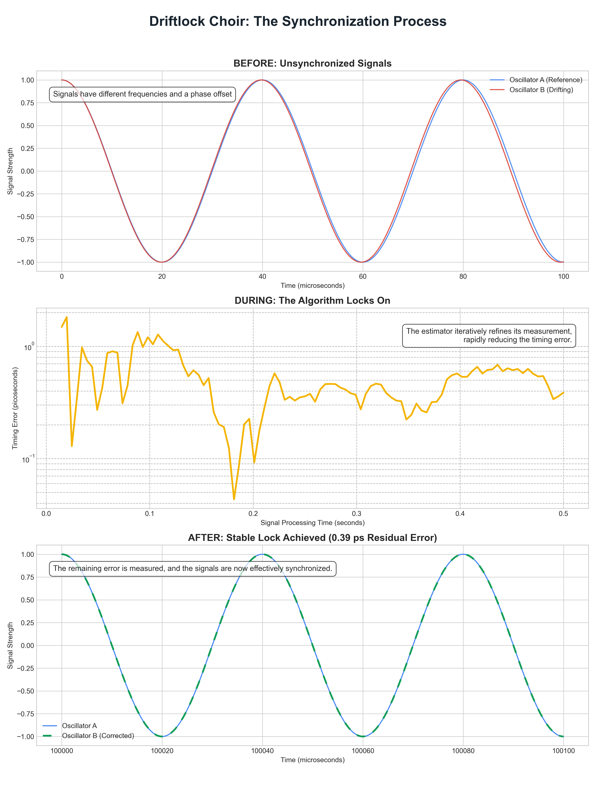

# Driftlock Choir



> The open-source foundation for a breakthrough wireless synchronization technology, actively transitioning from proven theory to hardware validation.

[](LICENSE)
[](https://www.python.org/downloads/)

## The Vision: Fiber-Level Precision, Wirelessly

Driftlock Choir is a research project developing **chronometric interferometry**, a technique to synchronize distributed systems over-the-air with picosecond-level precision. Our goal is to deliver the timing performance of dedicated fiber optics with the flexibility and low cost of wireless radio.

This repository contains the full software stack—from first-principles physics models to statistical estimators and hardware bridges—to design, simulate, and validate this next-generation timing infrastructure.

## The Musical Analogy

At its heart, chronometric interferometry is like tuning a choir of musicians.

Imagine two oscillators (musicians) playing at nearly the same frequency. The slight difference in their frequencies creates a slow, audible "wah-wah-wah" sound—a **beat note**. The phase of this beat note tells us two things: how far apart the musicians are (propagation delay, **τ**) and exactly how out of tune they are (frequency offset, **Δf**).

Driftlock Choir is a system that can "listen" to this beat note with extreme precision, allowing us to get an entire network of wireless devices to "sing" in perfect, coherent harmony.


*Figure 1 – The system-level schematic, showing the two-way signal exchange, beat-note formation, and parameter extraction that makes picosecond-scale timing possible.*

## Significance & Impact

Achieving picosecond-level wireless timing is not an incremental improvement; it is a categorical leap in performance that enables entirely new applications.

**How Precise is 13.5 Picoseconds?**
*   **In Perspective:** Light travels just **4 millimeters** in 13.5 ps.
*   **vs. GPS:** Over 100x more precise than standard GPS, and it works indoors.
*   **vs. White Rabbit:** Competes with the performance of White Rabbit, the gold standard for wired timing, but without the need for expensive, dedicated fiber optic cables.

| Technology | Typical Precision | Medium |
| :--- | :--- | :--- |
| NTP | Milliseconds (10⁻³ s) | Internet |
| PTP | Microseconds (10⁻⁶ s) | Ethernet |
| GPS | Nanoseconds (10⁻⁹ s) | Satellite RF |
| White Rabbit | **Tens of Picoseconds** (10⁻¹² s) | **Fiber Optic** |
| **Driftlock Choir** | **Tens of Picoseconds** (10⁻¹² s) | **Wireless RF** |

This capability is a direct enabler for...
*   **6G Wireless:** Realizing the vision of Joint Communication and Sensing (JCAS), where base stations act as a coherent radar system for high-resolution environmental mapping.
*   **Autonomous Systems:** Allowing teams of robots or autonomous vehicles to fuse their sensor data with near-perfect correlation, enabling safer and more complex coordinated actions.
*   **Distributed Computing:** Enabling massive, low-cost radio telescopes, distributed beamforming, and other coherent signal processing applications.
*   **Augmented Reality:** Creating believable, shared multi-user AR experiences free of the motion sickness and artifacts caused by timing mismatches.

## Project Status & Milestones

The project is currently in **Phase 1: Foundational Credibility**. The core algorithms have been validated in a comprehensive Python simulation, and we are now focused on hardware implementation.

*   ✅ **Proven in Simulation:** Achieved **13.5 ps** line-of-sight timing recovery and **0.09 ps** residual error in high-band simulations.
*   ✅ **Characterized Limits:** Documented failure modes in noisy, high-multipath environments, which defines our primary research challenge.
*   ➡️ **Hardware Validation:** The immediate and most critical goal is to reproduce these results on real hardware.

For a detailed view of our phased development plan, current research challenges, and future goals, please see our public **[Technical Roadmap](ROADMAP.md)**.

## Quick Start

Get the code and install dependencies:
```bash
git clone https://github.com/Shannon-Labs/driftlock-choir.git
cd driftlock-choir/driftlockchoir-oss
pip install -r requirements.txt
```

Run the clean E1 chronometric interferometry experiment (13.5 ps delay):
```bash
python run_experiment.py --tau-ps 13.5 --delta-f-hz 150
```

Explore the results and visualizations in the interactive walkthrough notebook:
```bash
jupyter notebook docs/examples/e1_cli_walkthrough.ipynb
```

## Collaboration & Open Core Model

This project uses an **"Open Core"** model. The core simulation framework is open-source (MIT) to foster academic collaboration and peer review. The high-performance, hardware-specific implementations (e.g., for FPGAs) are proprietary and form the basis for future commercialization.

We are committed to validating our work through peer-reviewed publication in high-impact venues.

For a deeper dive into the theory, technical challenges, and scientific context, please see our detailed Q&A:

➡️ **[Frequently Asked Questions (Q&A.md)](Q&A.md)**

## Citation

If you use this work in your research, please cite it as:
```
@software{driftlock_choir_2025,
  title = {Driftlock Choir: An Open-Source Framework for Picosecond-Scale Wireless Synchronization via Chronometric Interferometry},
  author = {Shannon Labs and Community Contributors},
  year = {2025},
  url = {https://github.com/Shannon-Labs/driftlock-choir},
  note = {Version X.Y.Z, hardware validation in progress}
}
```

## License

Released under the [MIT License](LICENSE).
