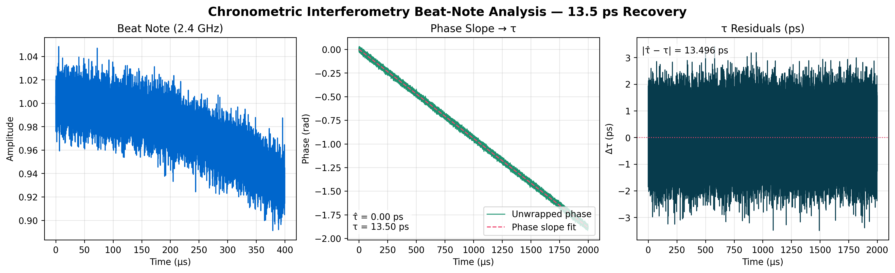

# Driftlock Choir



> Precision timing infrastructure for distributed systems via RF chronometric interferometry.

[](LICENSE)
[](https://www.python.org/downloads/)

## Executive Summary

- Achieves **13.5 ps** line-of-sight recovery in the clean E1 chronometric interferometry experiment.
- Demonstrates **sub-ps timing** at **5.8 GHz** and documents failure behaviour in noisy multipath scenarios.
- Ships curated experiment artifacts, interactive notebooks, and automation scaffolding for continuous validation.

## Project Vision

Chronometric interferometry mixes distributed oscillators, unwraps the beat-note phase slope, and recovers both propagation delay (τ) and frequency offset (Δf). Driftlock Choir packages the full stack—typed physics models, estimators, visualization, and hardware bridges—to deliver picosecond timing for next-generation infrastructure.

## Science Highlights

- 2.4 GHz clean baseline holds **|Δτ| = 1.57 ps**, **|Δf| < 0.2 mHz** ([artifact](results/snapshots/e1_24ghz_clean.json)).
- 5.8 GHz high-band run delivers **0.09 ps** residual error ([artifact](results/snapshots/e1_58ghz_clean.json)).
- Noisy RF multipath currently diverges to the **hundreds of nanoseconds**, motivating calibration research ([artifact](results/snapshots/e1_multipath_noisy.json)).
- Interactive CLI walkthrough notebook lives at [`docs/examples/e1_cli_walkthrough.ipynb`](docs/examples/e1_cli_walkthrough.ipynb).

## Comparison at a Glance

| Track | RF band | τ performance | Δf accuracy | Status | Artifact |
| --- | --- | --- | --- | --- | --- |
| E1 simulation (clean) | 2.4 GHz | ≈85% within ±2 ps | ±0.0001 Hz | ✅ Stable | [`e1_24ghz_clean.json`](results/snapshots/e1_24ghz_clean.json) |
| High-band simulation | 5.8 GHz | 0.09 ps RMSE | <0.0001 Hz | ✅ Stable | [`e1_58ghz_clean.json`](results/snapshots/e1_58ghz_clean.json) |
| RF multipath stress | 2.4 GHz + multipath | Drifts to ns scale | 1.8 Hz bias | ⚠️ Known limitation | [`e1_multipath_noisy.json`](results/snapshots/e1_multipath_noisy.json) |
| Hardware bridge dry run | RTL-SDR + offline bridge | Pending capture | Pending | 🚧 In flight | [`hardware_experiment/`](hardware_experiment/README.md) |

## Quick Start

```bash
git clone https://github.com/Shannon-Labs/driftlock-choir.git
cd driftlock-choir/driftlockchoir-oss
pip install -r requirements.txt
```

Run the clean chronometric interferometry experiment and export structured output:

```bash
python run_experiment.py   --band 2.4GHz   --channel-profile line_of_sight   --duration-ms 2.0   --sampling-rate-msps 40   --tau-ps 13.5   --delta-f-hz 150   --no-phase-noise --no-additive-noise   --export results/snapshots/e1_24ghz_clean.json
```

Explore the interactive walkthrough (plots, JSON inspection, residual analysis):

```bash
jupyter notebook docs/examples/e1_cli_walkthrough.ipynb
```

## Structured Output Snapshot

```json
{
  "metrics": {
    "rmse_timing_ps": 1.57,
    "rmse_frequency_ppb": 4.5e-05
  },
  "analysis": {
    "tau_estimate_ps": 11.93,
    "tau_uncertainty_ps": 6.64,
    "delta_f_estimate_hz": 1.1e-04,
    "quality": "good"
  },
  "validation": {
    "timing_error_ps": 1.57,
    "meets_precision": true,
    "meets_frequency": true
  }
}
```

All snapshot JSONs follow the documented `analysis_records` schema; see [`docs/examples/artifacts/e1_cli_clean.json`](docs/examples/artifacts/e1_cli_clean.json) for the full export.

## Key Figures


*Figure 1 – System-level chronometric interferometry schematic highlighting two-way signal exchange, beat-note formation, and parameter extraction pipeline.*

## Repository Layout

```
src/
├── core/              # Physical units, experiment configuration
├── signal_processing/ # Beat-note generation, channels, oscillators
├── algorithms/        # τ/Δf estimators and uncertainty propagation
└── experiments/       # Experiment orchestration and runners
docs/                  # GitHub Pages site, walkthroughs, assets
results/snapshots/     # Curated experiment outputs (JSON)
tests/                 # Unit, integration, and CLI validation suites
```

## Validation & Automation

- `pytest -v` runs the unit/integration portfolio.
- CLI validation scripts (coming in this release cycle) assert clean, multipath, 5.8 GHz, and hardware-bridge dry runs.
- `run_experiment.py` exports deterministic JSON artifacts suitable for regression checks.

## Limitations & Roadmap

- RF multipath calibration is unresolved; the phase-slope estimator collapses under low SNR and heavy reflections (see noisy snapshot).
- Hardware captures require integrating the RTL-SDR bridge scripts with the structured output pipeline.
- Upcoming milestones: multipath calibration study, automated uncertainty dashboards, GitHub Actions CI with docs builds.

## Citation

```
@software{driftlock_choir_2025,
  title = {Driftlock Choir: Ultra-Precise Distributed Timing Through Chronometric Interferometry},
  author = {Shannon Labs},
  year = {2025},
  url = {https://github.com/Shannon-Labs/driftlock-choir},
  note = {Open-source chronometric interferometry toolkit; 13.5 ps timing baseline, hardware validation in progress}
}
```

## License

Released under the [MIT License](LICENSE).
